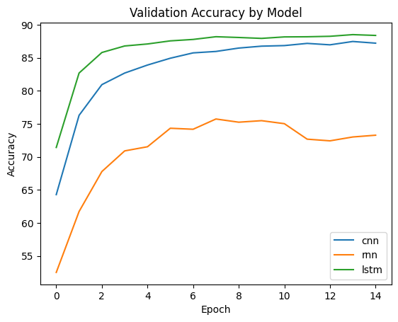

# Twitter Sentiment Analysis - Pytorch

## Description

This repository contains the implementation of deep learning sentiment analysis models using CNN, RNN and LSTM model architecture.  

Training and testing data consists of a collection of tweets sourced from the following [kaggle data repository](https://www.kaggle.com/datasets/jp797498e/twitter-entity-sentiment-analysis/data), with the following classification categories:

- Negative : 0
- Positive : 1
- Neutral : 2
- Irrelevant : 3

Data was pre-processed and tokenized using [nltk](https://www.nltk.org/)'s TweetTokenizer.

## Results

The following figure details the validation accuracy of each model on the dataset:  

The following table details the model accuracy on the testing dataset for the best-performing model of each architecture:

|       RNN        |        CNN       |       LSTM       |
|------------------|------------------|------------------|
|     0.83913      |     0.94156      |      0.9272      |

## Requirements

(Substitute pytorch for the latest stable CPU build if GPU is not avaiable)

- python = 3.10.9
- nltk = 3.8.1
- pytorch = 2.1.2+cu118
- cuda = 11.6
- gensim = 4.3.2

## Usage

To use the repository, first clone the repository. Then, see the `main.ipnyb` file to see examples of training, testing, and predicting using the model
